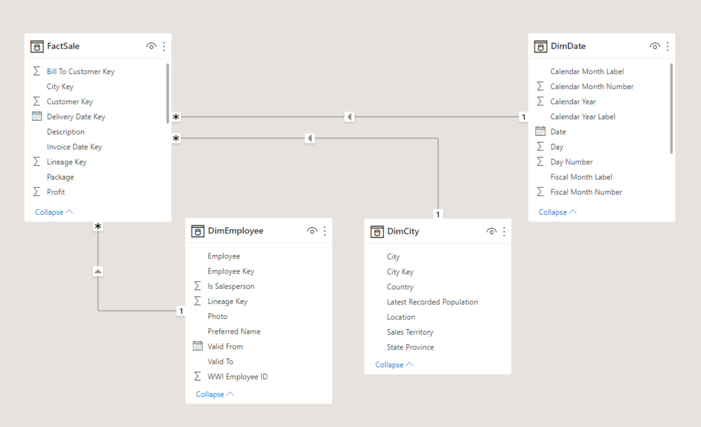
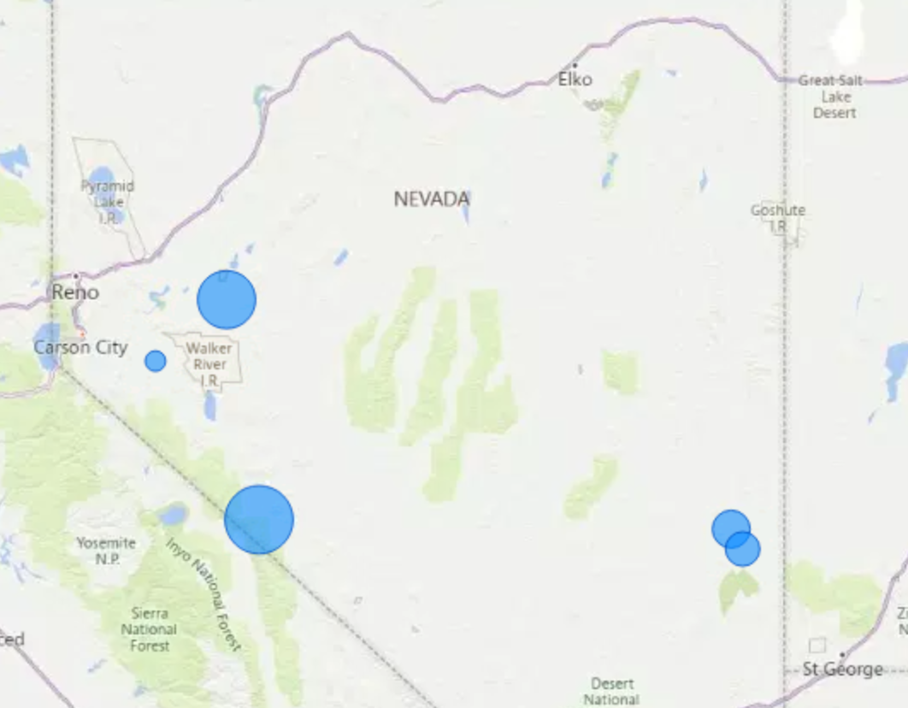
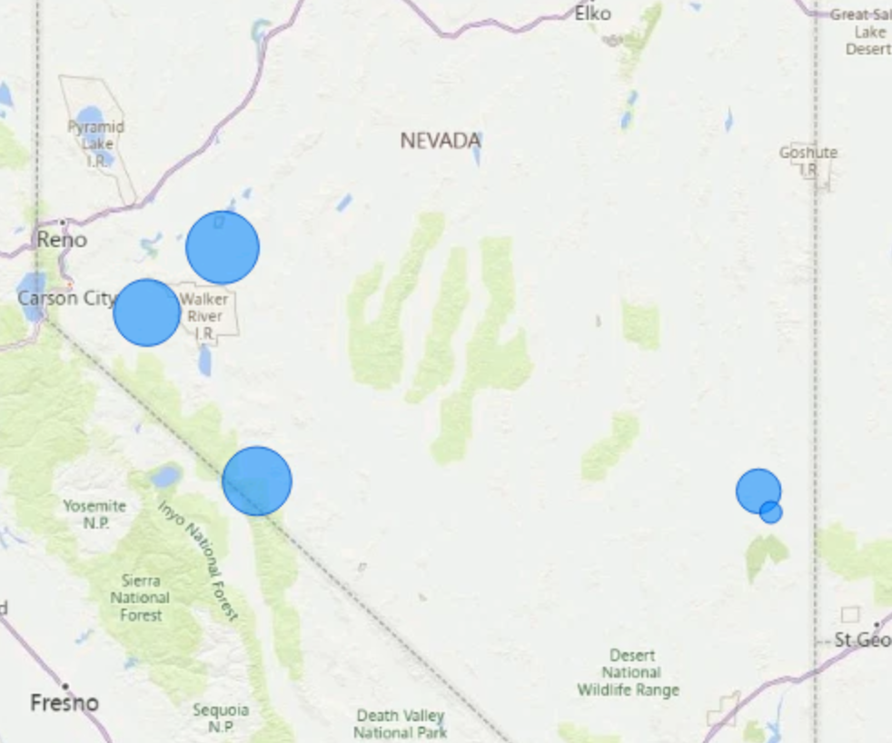
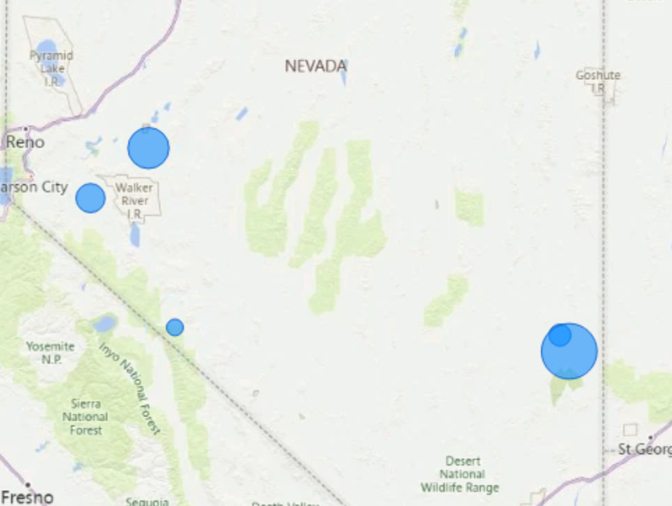
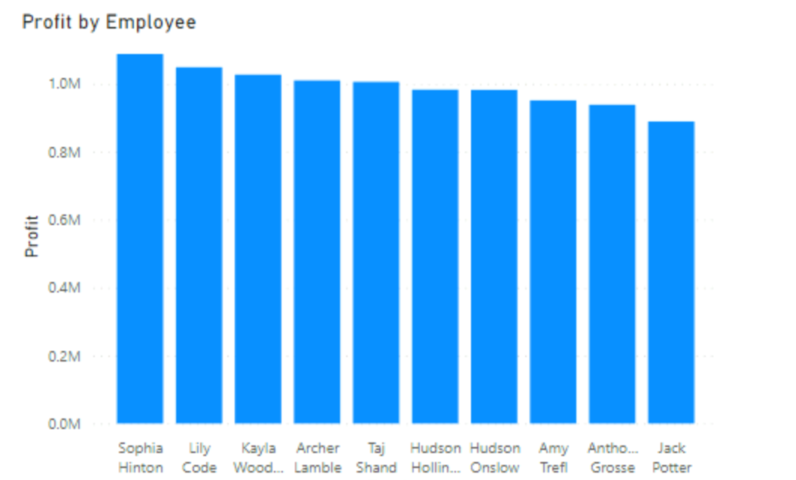
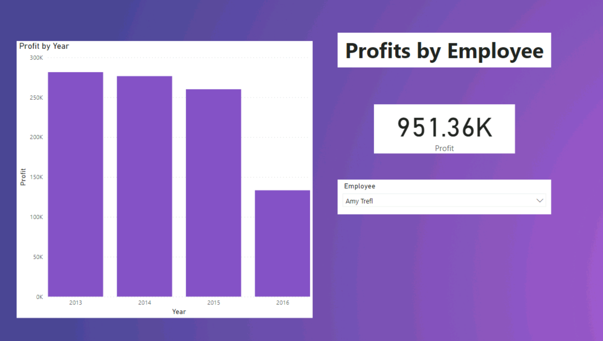

# Profit_Analysis
Used Power BI to create an interactive map that shows the profit in each state

## Overview

Used Power BI to visualize sales data from a fictional company. Created a map showing the profit made in different states and provinces from 2013-2016. In addition, profits made by each employee were visualized. The data originated from a DataCamp course, "Introduction to Power BI". This project does not copy the methodology presented in the course, but rather expands upon the concepts that were taught.

## Results

